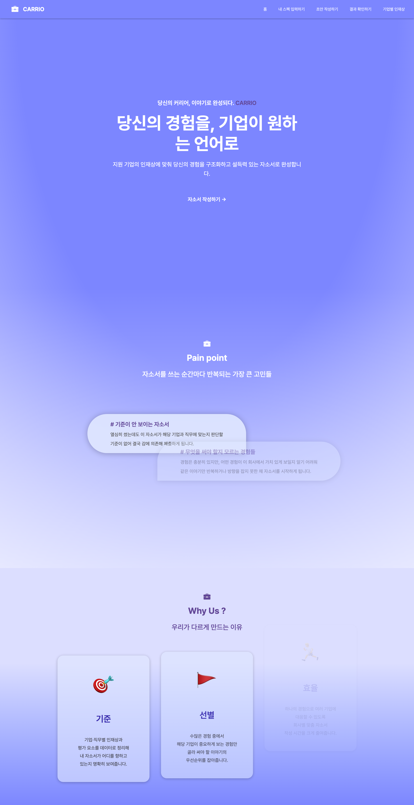
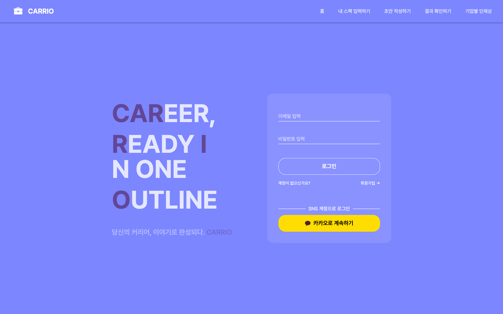
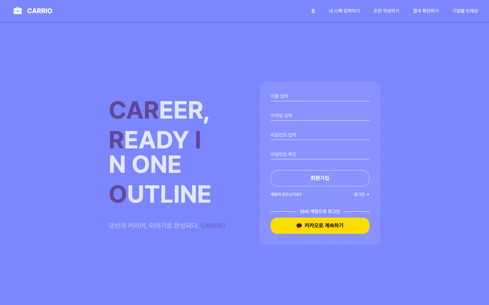
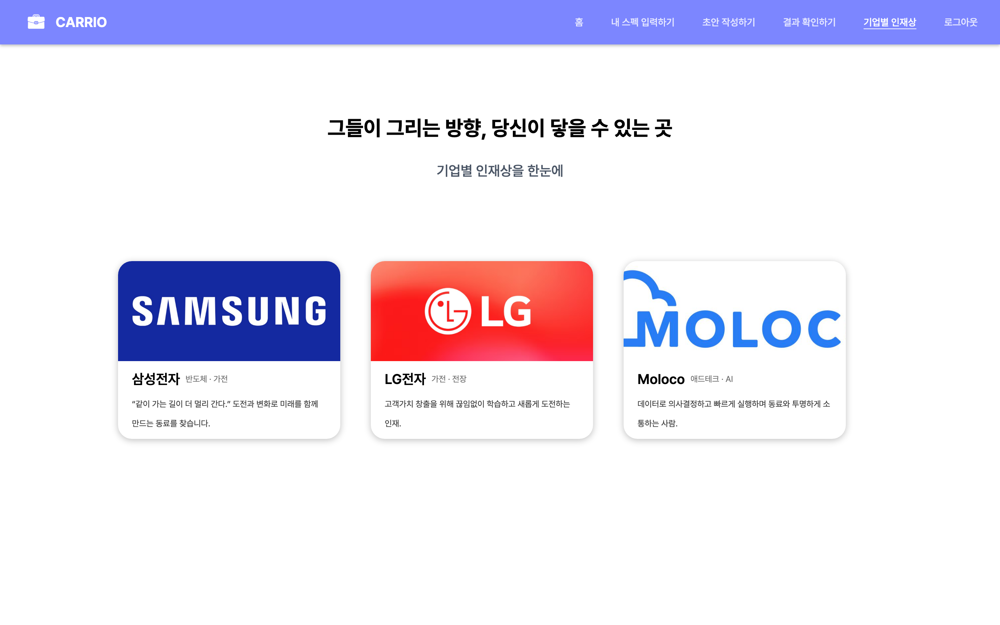
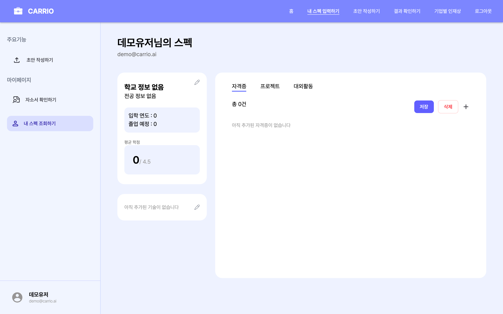
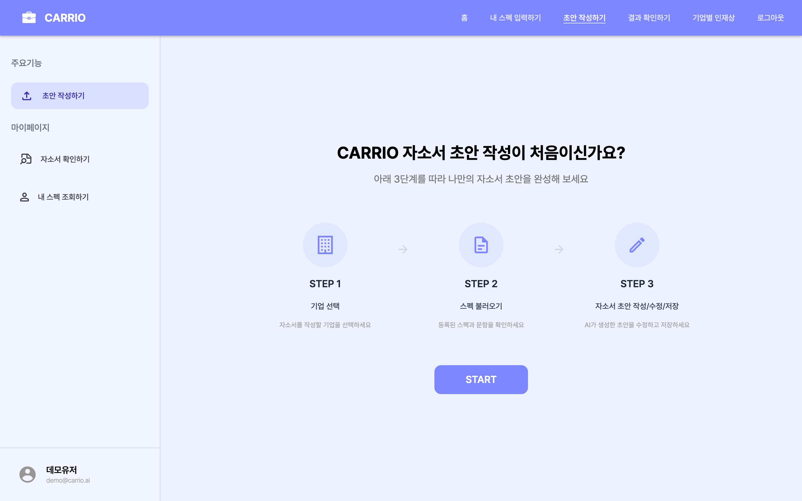
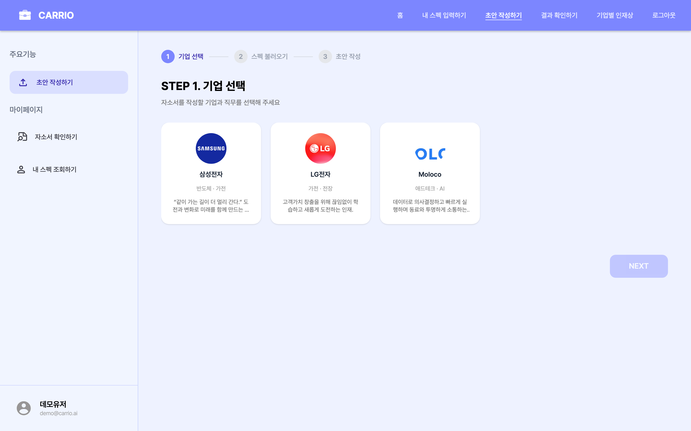
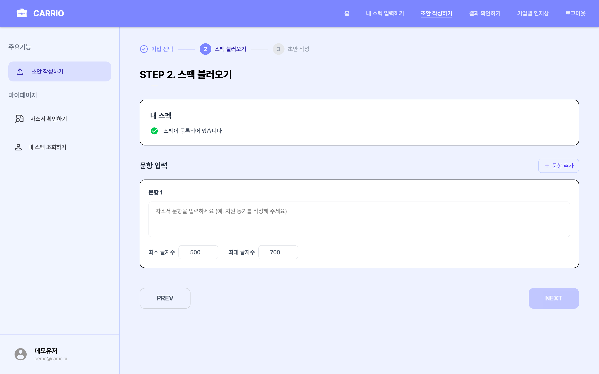

<div align="center">

# CARRIO

**당신의 커리어, 이야기로 완성되다.**

기업 인재상을 데이터로 분해하고, 지원자의 경험을 그 언어에 맞춰 재구성해주는 AI 자소서 코파일럿

[](https://fastapi.tiangolo.com/)
[](https://github.com/pgvector/pgvector)
[](https://langchain-ai.github.io/langgraph/)
[](https://platform.openai.com/)



</div>

---

## 왜 만들었나 — Pain point

자소서를 쓸 때마다 반복되던 세 가지 고민에서 출발했습니다.

| 고민 | 현상 |
|---|---|
| **기준이 안 보인다** | 열심히 썼는데도 이 자소서가 해당 기업·직무에 맞는지 판단할 기준이 없어, 결국 감으로 제출하게 됩니다. |
| **무엇을 써야 할지 모른다** | 경험은 있지만, 어떤 경험이 이 회사에서 가치 있게 보일지 알기 어려워 같은 이야기만 반복하게 됩니다. |
| **시간이 부족하다** | 지원해야 할 기업은 많은데, 회사별로 새로 쓸 시간이 없어 완성도 낮은 자소서를 급하게 제출합니다. |

CARRIO는 이걸 사람이 매번 다시 풀지 않도록, **기업 인재상 분석 → 경험 매칭 → 초안 생성**을 하나의 파이프라인으로 자동화합니다.

## 우리가 다르게 만드는 이유 — Why us

| | 무엇을 해주나 |
|---|---|
| **🎯 기준** | 기업·직무별 인재상과 평가 요소를 데이터(공개 채용 페이지·블로그·뉴스)에서 추출해, 자소서가 어디를 향해야 하는지 명확히 보여줍니다. |
| **🚩 선별** | 사용자가 등록한 경험(프로젝트·활동·자격증) 중에서 해당 기업이 중요하게 보는 경험만 골라 우선순위를 잡아줍니다. |
| **🏃 효율** | 같은 경험을 회사별로 다르게 풀어쓰도록 LLM이 톤·키워드·구조를 맞춰, 회사당 작성 시간을 크게 줄여줍니다. |

---

## 서비스 화면

### 1. 랜딩 — 서비스 소개
스크롤하면서 Pain point → Why us 흐름으로 가치 제안을 전달합니다.


### 2. 로그인 / 회원가입
이메일·비밀번호 로그인과 **카카오 OAuth** 지원. JWT Bearer 토큰 기반 인증.

| 로그인 | 회원가입 |
|---|---|
|  |  |

### 3. 기업별 인재상 — `/idealtalent`
LangGraph 파이프라인이 공개 데이터를 수집·요약해 만든 **기업 DNA** 카드.
사용자는 자소서를 쓰기 전에 회사의 핵심 가치·키워드·평가 포인트를 한눈에 볼 수 있습니다.



### 4. 내 스펙 입력 — `/spec`
프로젝트, 대외활동, 자격증, 학력, 기술 스택을 한 번 등록하면 모든 자소서에 재사용됩니다.



### 5. 자소서 초안 작성 — 3단계 워크플로우

#### Step 0. 가이드
처음 사용하는 사용자에게 전체 흐름을 보여주는 진입 화면.



#### Step 1. 기업·직무 선택
지원할 회사와 직무를 고르면, 그 회사의 인재상이 백그라운드에서 로딩됩니다.



#### Step 2. 문항 입력
공고에 적힌 자소서 문항을 그대로 붙여넣고, 글자수 제한까지 설정합니다.



#### Step 3. AI 초안 생성·수정·저장
AI가 생성한 초안 + 문항별 가이드 코멘트를 보면서 사용자가 직접 다듬어 저장합니다.

---

## 어떻게 동작하나 — AI 워크플로우

자소서 생성은 **두 개의 LangGraph 파이프라인**으로 나뉩니다.

```
                              ┌─────────────────────────────────────┐
                              │  ① 인재상 추출 (Extraction)         │
                              │  ─ 회사당 1회, 결과 캐싱             │
                              │                                     │
   사용자: 기업 선택  ───────► │  Researcher → Scraper → Analyzer    │ ──► talent_values
                              │  · Tavily 검색 쿼리 생성              │     (Postgres)
                              │  · Firecrawl로 공식 페이지 스크래핑   │
                              │  · LLM이 기업 DNA로 요약              │
                              └─────────────────────────────────────┘

                              ┌─────────────────────────────────────┐
                              │  ② 자소서 생성 (Generation)         │
                              │  ─ 문항 제출 시마다 1회 실행          │
   사용자: 문항 입력  ───────► │                                     │ ──► cover_letter
                              │  Strategist → Writer → Orchestrator │     (items JSONB)
                              │  · 매칭 전략 수립 (어떤 경험을 어디에) │
                              │  · 문항별 초안 작성                   │
                              │  · 길이·일관성·question_index 검수    │
                              └─────────────────────────────────────┘
```

### 6개의 Agent 역할

| Agent | 역할 |
|---|---|
| **Researcher** | 기업명 + 직군으로 Tavily 검색 쿼리를 만들고 결과를 수집 |
| **Scraper** | 검색 결과 중 신뢰할 수 있는 URL을 골라 Firecrawl로 본문 스크랩 |
| **Analyzer** | 스크랩한 콘텐츠를 LLM에 던져 **회사 DNA**(핵심 가치·키워드·요약)로 정제. `job_category` 유무로 프롬프트 분기 — 전사면 문화·가치, 직무면 그 직무의 경험 맥락에 집중 |
| **Strategist** | 사용자 스펙 ↔ 회사 DNA를 매칭해 "어떤 경험을 어떤 문항에 풀지" 전략 수립 |
| **Writer** | 문항별 초안 생성 + `guide_comments` (수정 가이드) 함께 반환 |
| **Orchestrator** | 결과 일관성·길이·문항 인덱스 검수, LLM이 빠뜨린 항목을 코드로 강제 보정 |

> 인재상 결과는 `talent_values` 테이블에 캐싱되어 같은 회사·직군이면 재호출 없이 즉시 응답합니다.

---

## 아키텍처

```
CARRIO-backend/                      ┌──────────────────────┐
├── app/                             │  Frontend            │
│   ├── domains/                     │  (CARRIO-client,     │
│   │   ├── auth/        ──── JWT ── │   React + Vite)      │
│   │   ├── users/                   └─────────┬────────────┘
│   │   ├── companies/                         │ HTTPS / Bearer JWT
│   │   ├── job_categories/                    ▼
│   │   ├── talent_values/  ◄── ① 인재상 추출 결과 캐싱
│   │   └── cover_letters/  ◄── ② 자소서 도메인 (items JSONB)
│   │
│   ├── shared/
│   │   ├── agent/      ─── LangGraph 파이프라인 (Extraction · Generation)
│   │   └── database/   ─── SQLAlchemy 2.0 + pgvector
│   │
│   └── main.py         ─── FastAPI 진입점, CORS, 라우터 등록
│
├── alembic/            ─── DB 스키마 버전 관리
└── docker-compose.yml  ─── pgvector/pgvector:pg16
```

**Modular Monolith** 구조 — 도메인별로 `router / schemas / models / service / exceptions`를 한 폴더 안에 두고, 공용 인프라(DB·Agent·인증)는 `shared/`에서 공유합니다.

### 기술 스택

| 분류 | 사용 기술 |
|---|---|
| Framework | FastAPI · Uvicorn |
| ORM / DB | SQLAlchemy 2.0 · PostgreSQL + pgvector · Alembic |
| Auth | JWT (HS256) · Kakao OAuth |
| AI / LLM | OpenAI · LangChain · LangGraph · Tavily · Firecrawl |
| Validation | Pydantic v2 |
| Frontend | React 19 · TypeScript · Vite · Tailwind v4 · Zustand · Framer Motion |

---

## 빠른 시작

### 1. 저장소 클론
```bash
git clone https://github.com/WINK-CARRIO/CARRIO-backend.git
cd CARRIO-backend
```

### 2. 가상환경 설정
```bash
python3 -m venv venv
source venv/bin/activate  # Windows: venv\Scripts\activate
```

### 3. 패키지 설치
```bash
pip install -r requirements.txt
```

### 4. 환경 변수 설정
```bash
cp .env.example .env
```

**`.env` 파일에서 수정할 값:**
```bash
# 필수 - OpenAI API 키
OPENAI_API_KEY=sk-proj-...

# 선택 - 카카오 로그인 사용 시
KAKAO_CLIENT_ID=
KAKAO_CLIENT_SECRET=

# JWT 시크릿 (32자 이상 권장)
SECRET_KEY=...
```

**API 키 발급처**
- OpenAI: https://platform.openai.com/api-keys
- Kakao Developers: https://developers.kakao.com
- Tavily / Firecrawl: 각 서비스 콘솔에서 API 키 발급

### 5. 데이터베이스 실행
```bash
docker-compose up -d
docker-compose ps          # 상태 확인
docker-compose logs -f postgres
```

### 6. 마이그레이션 적용
```bash
alembic upgrade head
```
> 자세한 사용법은 [ALEMBIC_GUIDE.md](./ALEMBIC_GUIDE.md) 참고.

### 7. 서버 실행
```bash
# venv 변경 감지 제외 (권장)
uvicorn app.main:app --reload --reload-exclude 'venv/*'
```

| 접속 경로 | 용도 |
|---|---|
| http://localhost:8000/health | Health Check |
| http://localhost:8000/docs | Swagger UI |
| http://localhost:8000/redoc | ReDoc |

---

## API 엔드포인트

Base path: `/api/v1`

| 도메인 | 경로 | 주요 기능 |
|---|---|---|
| Auth | `/auth/login`, `/auth/signup`, `/auth/kakao/*` | 이메일·카카오 로그인 |
| Users | `/users/me` | 내 정보 조회·수정 |
| Companies | `/companies` | 기업 목록 (공개) |
| Job Categories | `/companies/{id}/job-categories` | 기업별 직군 조회 |
| Talent Values | `/companies/{id}/talent-values` | 기업 인재상 (캐시 우선) |
| Cover Letters | `/cover-letters` | 자소서 생성·조회·수정·삭제 |
| User Specs | `/user-specs` | 내 스펙(경험·학력·자격증·기술) CRUD |

> 관리자 전용 라우트는 `/admin/...` 으로 분리되어 있으며 `role=admin` JWT가 필요합니다.

---

## 개발 환경

### 필수 요구사항
- Python 3.9+
- Docker Desktop (PostgreSQL+pgvector 실행)
- OpenAI API Key (필수), Tavily/Firecrawl Key (인재상 추출에 필요)

### DB GUI 도구
```bash
brew install --cask tableplus     # Mac 추천
brew install --cask dbeaver-community  # Windows/Linux 추천
```

**연결 정보** — host: `localhost`, port: `5432`, user: `postgres`, pw: `postgres123`, db: `CARRIO`

### Kakao OAuth Redirect URI 등록

카카오 개발자 콘솔에 아래 Redirect URI를 등록해야 합니다.

- Local: `http://localhost:8000/api/v1/auth/kakao/callback`
- Production: `https://api.example.com/api/v1/auth/kakao/callback`

---

## 팀

| 멤버 | 담당 |
|---|---|
| clark1015 (junhwan) | 리드 · Users · JobCategories · DB 설계 |
| MinJuTur | Companies · TalentValues CRUD |
| gain | Auth · Kakao OAuth · 관리자 |
| hyeongmin | AI Agent · CoverLetters · 인재상 AI 추출 |
